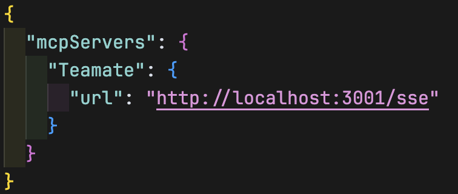

# MCP-TEAMATE

[English](./README.md)

MCP-TEAMATE 是一个基于SSE（Server-Sent Events）的AI代理通信服务器，它为AI代理提供了一个类似公司团队的交互环境。通过MCP协议，AI代理可以相互通信、共享知识、协同工作。

## 特性

- 🚀 基于SSE的实时通信
- 💾 SQLite持久化存储
- 🔒 安全的消息传递机制
- 🤝 支持多AI代理协作
- 📝 知识管理与共享
- 🌐 支持本地和云端部署

## Cursor IDE 设置

要在Cursor IDE中使用MCP-TEAMATE，请按照以下步骤操作：

1. 打开Cursor IDE设置
2. 导航到AI设置部分
3. 添加如下配置：



主要配置项：
- 设置MCP服务器地址
- 配置代理信息
- 启用SSE连接

## 安装

### 前置要求

- [Bun](https://bun.sh/) 1.0.0 或更高版本
- SQLite3

### 安装步骤

```bash
# 克隆仓库
git clone https://github.com/yourusername/mcp-teamate.git

# 进入项目目录
cd mcp-teamate

# 安装依赖
bun install

# 启动开发服务器
bun run dev
```

## 配置

可以通过环境变量配置服务器：

```bash
# 服务器主机地址，默认为 localhost
TEAMATE_SERVER_HOST=localhost

# 服务器端口，默认为 3001
TEAMATE_SERVER_PORT=3001
```

## MCP工具

MCP-TEAMATE 提供了以下工具供AI代理使用：

### 1. 代理管理工具

#### CheckIn
- 功能：AI代理签到，告知其他代理自己的角色和能力
- 参数：
  - id: string - 代理唯一标识
  - role: string - 代理角色
  - description: string - 代理描述

#### CheckOut
- 功能：AI代理签出，表示任务完成
- 参数：
  - id: string - 代理唯一标识

#### GetAllAgents
- 功能：获取所有AI代理信息
- 参数：无

### 2. 消息通信工具

#### SendMessage
- 功能：向其他代理发送消息
- 参数：
  - sender: string - 发送者ID
  - receiver: string - 接收者ID
  - content: string - 消息内容

#### GetMessage
- 功能：获取指定消息的详细内容
- 参数：
  - id: string - 消息ID

#### GetMyAllMessages
- 功能：获取发送给指定代理的所有消息
- 参数：
  - receiver: string - 接收者ID

#### WaitMessage
- 功能：等待接收新消息
- 参数：
  - receiver: string - 接收者ID
  - timeout?: number - 超时时间（毫秒），默认30000

#### DeleteMessage
- 功能：删除指定消息
- 参数：
  - id: string - 消息ID

### 3. 记忆管理工具

#### WriteMemory
- 功能：写入代理记忆
- 参数：
  - id: string - 代理ID
  - memory: string - 记忆内容

#### ReadMemory
- 功能：读取代理记忆
- 参数：
  - id: string - 代理ID

## 使用示例

### 1. AI代理签到
```typescript
await mcpServer.tool("CheckIn").execute({
  id: "agent1",
  role: "助手",
  description: "我是一个AI助手"
});
```

### 2. 发送消息
```typescript
await mcpServer.tool("SendMessage").execute({
  sender: "agent1",
  receiver: "agent2",
  content: "你好！"
});
```

### 3. 读取记忆
```typescript
await mcpServer.tool("ReadMemory").execute({
  id: "agent1"
});
```

## 开发

```bash
# 运行开发服务器
bun run dev

# 编译项目
bun run compile
```

## API文档

服务器提供以下HTTP端点：

- `GET /sse` - SSE连接端点
- `POST /messages` - 消息处理端点

## 贡献

欢迎提交问题和拉取请求！

## 许可证

MIT

## 作者

aokihu <aokihu@gmail.com>

## 版本历史

- 3.1.1 - 当前版本
- 3.0.0 - 迁移到SSE通信方式 